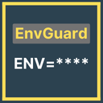

# EnvGuard

EnvGuard is a Visual Studio Code extension that helps protect sensitive information in your environment files by hiding values while you work.



## Features

- **Hide Sensitive Values**: Automatically masks values in environment files to prevent accidental exposure
- **Configurable File Patterns**: Customize which files are protected (default: `.env` and `.env.*`)
- **Toggle Visibility**: Easily toggle between hidden and visible modes with a command


## Usage

1. Open any environment file (`.env`, `.env.local`, etc.)
2. Values are automatically hidden with asterisks (`*****`) that match the length of the actual values
3. To toggle visibility for all values, use the command: `EnvGuard: Toggle Environment Values Visibility`

## Extension Settings

This extension contributes the following settings:

* `envguard.filePatterns`: Array of file patterns to apply protection (glob patterns supported)
* `envguard.hideValues`: Enable/disable value hiding (default: true)

## Commands

* `envguard.toggleVisibility`: Toggle between showing and hiding all environment values

## Known Issues

- Currently only supports environment files with `KEY=value` format
- May not work correctly with multi-line values

## Release Notes

### 0.0.1

- Initial release of EnvGuard
- Basic functionality for hiding/showing environment values
- Configurable file patterns
- Toggle command

---

## Development

### Building the Extension

1. Clone the repository
   ```
   git clone https://github.com/projectashik/envguard.git
   cd envguard
   ```
2. Run `pnpm install`
3. Press `F5` to start debugging

### Publishing

Follow the [VS Code Extension Publishing Guide](https://code.visualstudio.com/api/working-with-extensions/publishing-extension)

## Contributing

Contributions are welcome! Please feel free to submit a Pull Request.

## License

This extension is licensed under the [MIT License](LICENSE).

---

**Enjoy!**
